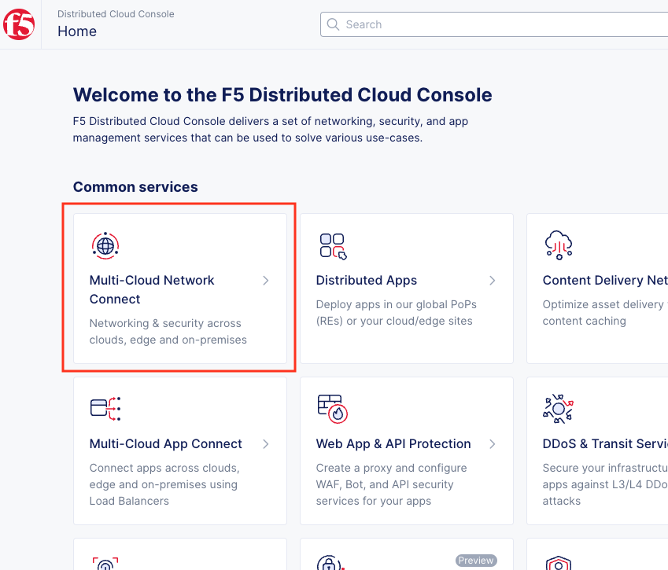

#   Deployment instructions

## Deploy infrastructure

Before running the Terraform script, please ensure that you have [installed the Azure CLI](https://learn.microsoft.com/en-us/cli/azure/install-azure-cli) and have s[signed in to your Azure Account](https://learn.microsoft.com/en-us/cli/azure/authenticate-azure-cli). It is required that you have the **Owner** role and create service principal subscription with **Contributor** role for it. You also must [accept the subscription agreement](https://docs.cloud.f5.com/docs/how-to/site-management/create-azure-site#accept-subscription-agreement) to deploy the XC Azure VNET Site.

Open the **./azure-site/var.tf** file and fill in the variables with your Azure Tenant ID and Subscription ID:

    variable "azure_subscription_id" {
        type = string
        default = "your_subscription_id"
    }

    variable "azure_subscription_tenant_id" {
        type = string
        default = "your_tenant_id"
    }

Find **xc_api_url** variable and fill it with your F5 xC tenant name.

    variable "xc_api_url" {
        type = string
        default = "https://your_tenant.console.ves.volterra.io/api"
    }

Sign in to the F5 Distributed Cloud Console and open **Administration** tab.

Open **Credentials** section and click **Add Credentials**.

Fill the form as on the screen below and download your credentials file.

Copy credentials file to the scripts folder and fix path for the .p12 certificate in the **./azure-site/var.tf** file.

    variable "xc_api_p12_file" {
        default = "./path-to-api-cert.p12"
    }

Create **VES_P12_PASSWORD** environment variable with the password form the previous step.

    export VES_P12_PASSWORD=your_certificate_password

Navigate to the **azure-site** folder and initialize Terraform by running init command.

    cd ./azure-site
    terraform init

Apply Terraform script.

    terraform apply

Save the terraform output

    Outputs:

    application_id = "xxxxxxxxxxxxx"
    azure_vnet_name = "ha-services-ce-network"
    cluster_domain = "azure-ha-services-ce.your_tenant.tenant.local"
    kubecofnig_path = "../kubeconfig.conf"
    service_principal_password = <sensitive>
    subnet_a_name = "subnet_a"
    subnet_b_name = "subnet_b"
    subnet_c_name = "subnet_c"
    subscription_id = "xxxxxxxxxxxxx"
    tenant = "xxxxxxxxxxxxx"
    tenant_name = "tme-lab-works-oeaclgke"
    xc_private_key = <sensitive>
    xc_public_key = your_public_ssh_key

Open F5 Distributed Cloud Console and navigate to the Multi-Cloud Network Connect tab.

Open **Site List** and check the **Health Score**. It may take some time to provision the node.

## Deploy application

Open **./application** folder and edit the **var.tf** file

Update the **xc_api_p12_file** environment variable with the path for the .p12 certificate.

    variable "xc_api_p12_file" {
        default = "./path-to-api-cert.p12"
    }

Find the **xc_api_url** variable and fill it with your F5 xC tenant name.

    variable "xc_api_url" {
        type = string
        default = "https://your_tenant.console.ves.volterra.io/api"
    }

Find the **cluster_domain** variable in the terraform output from the previous step and update the value in the **var.tf** file. You can also find how to generate it [manually in the guide](https://github.com/f5devcentral/xcazurehacedemoguide#updating-db-deployment-chart-values)

    variable "cluster_domain" {
      type    = string
      default = "your_site_name.your_tenant_full_name.tenant.local"
    }

Fill the docker registry variables with your dockerhub credentials. You can use a [free account](https://hub.docker.com/signup).

    variable "registry_username" {
      type    = string
      default = ""
    }

    variable "registry_password" {
      type    = string
      default = ""
    }

    variable "registry_email" {
      type    = string
      default = ""
    }

Run the **terraform init** command

    terraform init

Run **apply** command to deploy the app

    terraform apply

## Azure-Site Variables description

Variable Name                  | Description                                                     | Default Value          
-------------------------------|-----------------------------------------------------------------|------------------------
environment                    | Environment name. Usually match with XC namspace name.          | "ha-services-ce"                   
xc_api_p12_file                | API credential p12 file path.                                   | "../api-creds.p12"                  
xc_api_url                     | Tenant API url file path.                                       | "https://**your_tenant_name**.console.ves.volterra.io/api"                   
kubeconfig_path                | Generated vk8s kubeconfig file path.                            | "../kubeconfig.conf"                   
azure_rg_location              | Azure Region name                                               | "centralus"
azure_subscription_id          | Azure Subscription Id                                           | ""
azure_subscription_tenant_id   | Azure Tenant Id                                                 | ""
azure_xc_machine_type          | Azure VM Type                                                   | "Standard_D3_v2"

## Application Variables description

Variable Name       | Description                                                     | Default Value          
--------------------|-----------------------------------------------------------------|------------------------
environment         | Environment name. Usually match with XC namspace name.          | "ha-services-ce"                   
xc_api_p12_file     | API credential p12 file path.                                   | "../api-creds.p12"                  
xc_api_url          | Tenant API url file path.                                       | "https://**your_tenant_name**.console.ves.volterra.io/api"                   
kubeconfig_path     | vk8s kubeconfig file path.                                      | "../kubeconfig.conf"                   
helm_path           | Helm charts path.                                               | "../../helm"
cluster_domain      | Cluster domain in format **{site_name}.{tenant_id}**.tenant.local. Where **site_name** is the Edge site name. Can be generated from [the guide](https://github.com/f5devcentral/xchacedemoguide#step-2-deploy-ha-postgresql-to-ce) or took from the terraform's output of the previous step.    |  **your_site_name.your_tenant_full_name**.tenant.local
registry_username   | Docker Registry Username                                        | ""
registry_password   | Docker Registry Password                                        | ""
registry_email      | Docker Registry Email                                           | ""
virtual_site_name   | Virtual Site Name                                               | "ha-services-ce-vs"

## Delete environment

Run the **terraform destroy** command in the **./application** forlder and then in the **./azure-site folder**

    terraform destroy